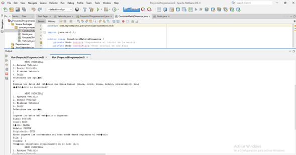
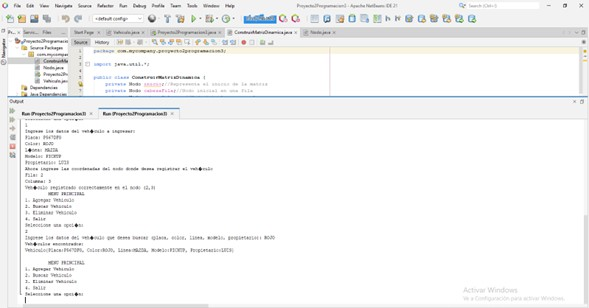
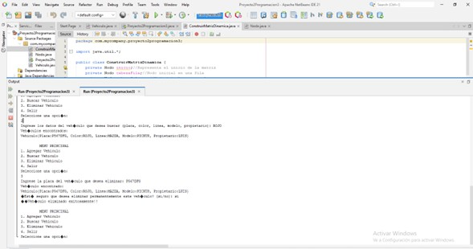

# Proyecto 2 - Programación III
---
---
**Proyecto desarrollado por:**
#### Roberto Antonio Ramirez Gomez 7690-22-12700
#### Jean Klaus Castañeda Santos 7690-22-892
#### Jonathan Joel Chan Cuellar 7690-22-1805

---
[ENLACE DEL REPOSITORIO EN GITHUB](https://github.com/rramirezg18/Proyecto-2-Programacion-3.git)
---
---
## Manual usuario y técnico
#### introduccion 

Este manual sirve como guía detallada para comprender y utilizar eficazmente el sistema de gestión de vehículos, una herramienta diseñada para simplificar y agilizar el manejo de vehículos en diversos contextos. Desarrollado como un programa en Java, este sistema ofrece una interfaz intuitiva y funcionalidades robustas para agregar, buscar y eliminar vehículos dentro de una matriz dinámica.

Con este manual, los usuarios podrán familiarizarse con cada aspecto del sistema, desde la instalación inicial hasta la ejecución de tareas avanzadas. Se proporcionan instrucciones claras y concisas para cada función, lo que permite a los usuarios, tanto principiantes como experimentados, aprovechar al máximo todas las características ofrecidas.

Desde la adición de nuevos vehículos hasta la búsqueda rápida y eficiente de información específica, este sistema ofrece una solución integral para la gestión vehicular. Además, se incluyen detalles sobre cómo optimizar el rendimiento del sistema y resolver posibles problemas que puedan surgir durante su uso.

---
---

## Requisitos del Sistema
Sistema operativo: Plataforma compatible con Java.

---
---

### Interfaz de Usuario:

Al iniciar el programa, se mostrará un menú principal con las siguientes opciones:
1. Agregar Vehiculo: Permite ingresar los datos de un vehículo y asignarlo a una posición en la matriz.
2. Buscar Vehiculo: Permite buscar un vehículo por su placa, color, línea, modelo o propietario.
3. Eliminar Vehiculo: Permite eliminar un vehículo de la matriz.
4. Salir: Cierra el programa.

---
## Funcionalidades:

#### Agregar Vehiculo:
-- Selecciona la opción "1" en el menú principal.
-- Ingresa los datos solicitados para el vehículo: placa, color, línea, modelo y propietario.
--- Luego, ingresa las coordenadas de la posición en la matriz donde deseas registrar el vehículo (fila y columna).
#### Buscar Vehiculo:
-- Selecciona la opción "2" en el menú principal.
-- Ingresa el dato que deseas buscar (placa, color, línea, modelo o propietario) y presiona Enter.
-- El sistema mostrará los vehículos encontrados que coincidan con el dato ingresado.
#### Eliminar Vehiculo:
-- Selecciona la opción "3" en el menú principal.
-- Ingresa la placa del vehículo que deseas eliminar y presiona Enter.
-- El sistema te pedirá confirmación antes de eliminar el vehículo de forma permanente.
#### Finalización del Programa:

-- Para salir del programa, selecciona la opción "4" en el menú principal.
### Notas Adicionales
-- Si el programa muestra un mensaje de error, sigue las instrucciones en pantalla para corregir el problema.
-- Se recomienda ingresar datos válidos y seguir las instrucciones del programa para un uso óptimo.

---
---
### descripcion 
Este manual proporciona una visión técnica del sistema de gestión de vehículos, detallando la estructura de clases y los métodos implementados. Ofrece una descripción detallada de cómo están organizadas las clases dentro del sistema y cómo se utilizan para gestionar la información y las operaciones relacionadas con los vehículos. Este enfoque técnico permite una comprensión profunda de la arquitectura del sistema y cómo se realizan las diferentes tareas de gestión de vehículos.

---
---
### Clases Principales
1. Clase ConstruirMatrizDinamica:

-- Gestiona la creación y manipulación de la matriz dinámica de vehículos.
-- Implementa métodos para agregar, buscar y eliminar vehículos en la matriz.
-- Utiliza la clase Nodo para representar cada elemento de la matriz.
2. Clase Nodo:

-- Representa un nodo de la matriz que contiene un vehículo y apuntadores a otros nodos.
-- Proporciona métodos para establecer y obtener el vehículo y los apuntadores.
3. Clase Proyecto2Programacion3:

-- Contiene el método main que inicia la ejecución del programa.
-- Implementa la lógica de interacción con el usuario a través de un menú.
-- Utiliza la clase ConstruirMatrizDinamica para gestionar la matriz de vehículos.
4. Clase Vehiculo:

.. Representa un vehículo con sus atributos como placa, color, línea, modelo y propietario.
.. Proporciona métodos para establecer y obtener los valores de los atributos.
---
---

### Limitaciones Conocidas

El programa puede no funcionar correctamente si se ingresan datos no válidos o se excede la capacidad de la matriz.

---
---
## Funcionamiento

El programa de gestión de vehículos está diseñado para facilitar el registro, búsqueda y eliminación de vehículos en una matriz dinámica implementada en Java. Esta matriz se construye utilizando nodos interconectados que representan cada posición en la matriz. La gestión de la matriz se realiza principalmente a través de la clase ConstruirMatrizDinamica, que contiene métodos para agregar, buscar y eliminar vehículos.

Cuando el programa se inicia, se instancia un objeto de la clase ConstruirMatrizDinamica, que representa la matriz vacía. Luego, se presenta un menú principal al usuario con opciones para agregar, buscar o eliminar vehículos, así como para salir del programa.

Al seleccionar la opción "Agregar Vehiculo", se solicitan al usuario los detalles del vehículo, como la placa, color, línea, modelo y propietario. Estos datos se utilizan para crear un objeto de la clase Vehiculo. Posteriormente, se especifica la posición en la matriz donde se desea agregar el vehículo, es decir, la fila y la columna. Utilizando el método agregar de la clase ConstruirMatrizDinamica, el vehículo se inserta en la posición especificada en la matriz. Si la posición ya está ocupada, se muestra un mensaje de error.

Para buscar un vehículo, el usuario selecciona la opción "Buscar Vehiculo" y proporciona un dato para buscar, como la placa, color, línea, modelo o propietario. Utilizando el método buscar de la clase ConstruirMatrizDinamica, se exploran todas las posiciones de la matriz para encontrar vehículos que coincidan con el dato proporcionado. Si se encuentran vehículos que coinciden, se muestran en pantalla sus detalles, como placa, color, línea, modelo y propietario. En caso de no encontrar coincidencias, se muestra un mensaje indicando que el vehículo no fue encontrado.

La opción "Eliminar Vehiculo" permite al usuario eliminar un vehículo de la matriz. Al seleccionar esta opción, se solicita al usuario ingresar la placa del vehículo que desea eliminar. Utilizando el método eliminar de la clase ConstruirMatrizDinamica, se busca y elimina el vehículo con la placa especificada. Se pide confirmación al usuario antes de realizar la eliminación permanente del vehículo. Si se confirma la eliminación, se elimina el vehículo de la matriz y se muestra un mensaje de confirmación. En caso de cancelación, se muestra un mensaje indicando que la eliminación fue cancelada.

El programa continúa ejecutándose en un bucle de menú hasta que el usuario selecciona la opción "Salir". En ese momento, se sale del bucle y el programa finaliza su ejecución. En resumen, el programa proporciona una interfaz simple y efectiva para gestionar una lista de vehículos mediante una matriz dinámica en Java.

---
---

---
---
---

---
---
---

---
---
---

---
---
---
### codigo

```java
package com.mycompany.proyecto2programacion3;
/**PROYECTO NO. 2
 * El proyecto consiste en crear una matriz ortogonal o dinamica para la administracion eficiente de memoria
 * La matriz almacera datos de vehiculos y permitira ingresar, buscar y eliminar
 * Jean Klaus Castañeda Santos		7690-22-892
 * Roberto Antonio Ramírez Gómez	7690-22-12700		
 * Jonathan Joel Chan Cuellar		7690-22-1805
 */

import java.util.*;

public class Proyecto2Programacion3 {

    public static void main(String[] args) {
        Scanner entrada = new Scanner(System.in);
        ConstruirMatrizDinamica matriz = new ConstruirMatrizDinamica();
        int opcion;
        int salir = 0;
        while (salir != 1) {
            Menu();
            opcion = entrada.nextInt();
            switch (opcion) {
	            case 1://Ingresar vehiculo
	                entrada.nextLine();
	                System.out.println("Ingrese los datos del vehículo a ingresar:");
	                System.out.print("Placa: ");
	                String placa = entrada.next();
	                System.out.print("Color: ");
	                String color = entrada.next();
	                System.out.print("Línea: ");
	                String linea = entrada.next();
	                System.out.print("Modelo: ");
	                String modelo = entrada.next();
	                System.out.print("Propietario: ");
	                String propietario = entrada.next();
	                System.out.print("Ahora ingrese las coordenadas del nodo donde desea registrar el vehículo\n");
	                System.out.print("Fila: ");
	                int fila = entrada.nextInt();
	                System.out.print("Columna: ");
	                int columna = entrada.nextInt();
	                matriz.agregar(placa, color, linea, modelo, propietario, fila, columna);
	                break;
                case 2://buscar
                	System.out.print("Ingrese los datos del vehículo que desea buscar (placa, color, linea, modelo, propietario): ");
                    String datoBuscar = entrada.next();
                    List<Nodo> nodosEncontrados = matriz.buscar(datoBuscar);
                    if (!nodosEncontrados.isEmpty()) {
                        System.out.println("Vehículos encontrados:");
                        for (Nodo nodoEncontrado : nodosEncontrados) {
                            System.out.println(nodoEncontrado.getVehiculo());
                        }
                    } else {
                        System.out.println("¡¡Vehículo no encontrado!!");
                    }
                    break;
                case 3://eliminar
                	System.out.print("Ingrese la placa del vehículo que desea eliminar: ");
                    String placaEliminar = entrada.next();
                    List<Nodo> nodosAEliminar = matriz.buscar(placaEliminar);
                    if (!nodosAEliminar.isEmpty()) {
                        for (Nodo nodoAEliminar : nodosAEliminar) {
                            System.out.println("Vehículo encontrado:");
                            System.out.println(nodoAEliminar.getVehiculo());
                            System.out.print("¿Está seguro que desea eliminar permanentemente este vehículo? (si/no): ");
                            String confirmacion = entrada.next();
                            if (confirmacion.equalsIgnoreCase("si")) {
                                matriz.eliminar(placaEliminar);
                                System.out.println("¡¡Vehículo eliminado exitosamente!!");
                            } else {
                                System.out.println("¡¡Eliminación cancelada!!");
                            }
                        }
                    } else {
                        System.out.println("¡¡Vehículo no encontrado!!");
                    }
                    break;
                case 4:
                    salir = 1;
                    break;
                default:
                    System.out.println("Opción inválida. Intente de nuevo.");
                    break;
            }
        }
    }

    public static void Menu() {//menu principal
        System.out.println("\n\t MENU PRINCIPAL ");
        System.out.println("1. Agregar Vehiculo");
        System.out.println("2. Buscar Vehiculo");
        System.out.println("3. Eliminar Vehiculo");
        System.out.println("4. Salir");
        System.out.println("Seleccione una opción:");
    }
}

```
