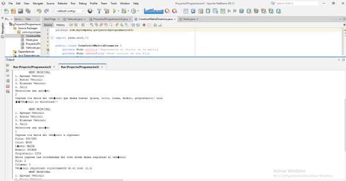
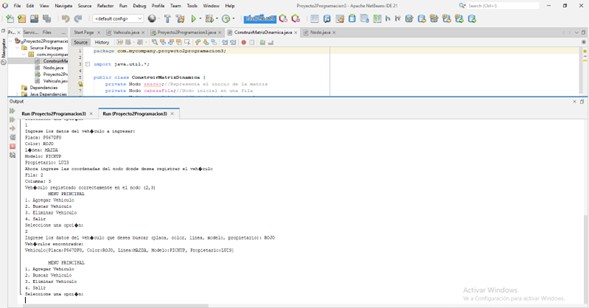
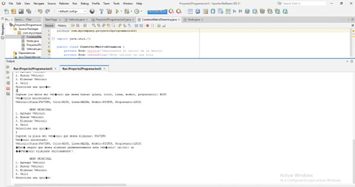
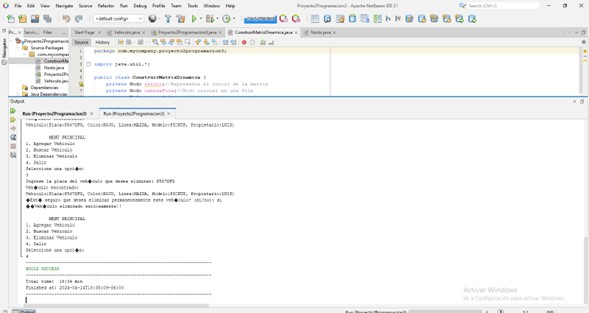

# Proyecto 2 - Programación III
---
---
**Proyecto desarrollado por:**
#### Roberto Antonio Ramirez Gomez 7690-22-12700
#### Jean Klaus Castañeda Santos 7690-22-892
#### Jonathan Joel Chan Cuellar 7690-22-1805

---
[ENLACE DEL REPOSITORIO EN GITHUB](https://github.com/rramirezg18/Proyecto-2-Programacion-3.git)
---
---
## Descripcion Del Proyecto:
Este proyecto se centra en la implementación de una estructura de datos eficiente para la gestión de información vehicular. Se propone crear una matriz ortogonal mediante el uso de listas enlazadas, abordando así el problema de asignación ineficiente de memoria presente en las matrices estáticas. Cada nodo de la lista contendrá datos clave sobre los vehículos, como la placa, color, línea, modelo, propietario, entre otros. El objetivo es optimizar la administración de memoria y permitir operaciones flexibles de inserción, búsqueda y eliminación, sin limitarse a un único criterio de búsqueda.

**El proyecto incluira las siguientes clases:**
- #### ConstruirMatrizDinamica.java
- #### Nodo.java
- #### Proyecto2Programacion3.java
- #### Vehiculo.java
---
## clase Nodo
---
---
Para el desarrollo del proyecto crearemos una clase llamada Nodo  esta parte del proyecto se enfoca en la implementación de la clase Nodo, la cual es fundamental para la construcción de una estructura de datos tipo árbol, específicamente un árbol de expresión. En este contexto, cada nodo representa un elemento del árbol y contiene un dato (en este caso, un vehículo) y dos referencias a otros nodos, uno para el hijo izquierdo y otro para el hijo derecho. Estas referencias funcionan como apuntadores en la estructura del árbol, permitiendo la navegación entre los nodos y la organización jerárquica de los datos. La clase Nodo proporciona métodos para establecer y obtener el vehículo asociado, así como para acceder a los hijos izquierdo y derecho, y también mantiene información sobre la posición del nodo en una matriz bidimensional (fila y columna). Esta implementación sienta las bases para la construcción y manipulación de árboles de expresión en el proyecto.

---
### Código

```java
package com.mycompany.proyecto2programacion3;

public class Nodo {
    private Vehiculo vehiculo;//Los atributos del vehiculo soon los datos que se ingresaran en cada nodo
    //Apuntadores
    private Nodo apuntadorArriba;
    private Nodo apuntadorAbajo;
    private Nodo apuntadorIzquierdo;
    private Nodo apuntadorDerecho;
    private int fila;
    private int columna;
    //constructor
    public Nodo(Vehiculo vehiculo, int fila, int columna) {
        this.vehiculo = vehiculo;
        this.apuntadorArriba = null;
        this.apuntadorAbajo = null;
        this.apuntadorIzquierdo = null;
        this.apuntadorDerecho = null;
        this.fila = fila;
        this.columna = columna;
    }
    //setters y getters
    public Vehiculo getVehiculo() {
        return vehiculo;
    }

    public void setVehiculo(Vehiculo vehiculo) {
        this.vehiculo = vehiculo;
    }

    public Nodo getApuntadorArriba() {
        return apuntadorArriba;
    }

    public void setApuntadorArriba(Nodo apuntadorArriba) {
        this.apuntadorArriba = apuntadorArriba;
    }

    public Nodo getApuntadorAbajo() {
        return apuntadorAbajo;
    }

    public void setApuntadorAbajo(Nodo apuntadorAbajo) {
        this.apuntadorAbajo = apuntadorAbajo;
    }

    public Nodo getApuntadorIzquierdo() {
        return apuntadorIzquierdo;
    }

    public void setApuntadorIzquierdo(Nodo apuntadorIzquierdo) {
        this.apuntadorIzquierdo = apuntadorIzquierdo;
    }

    public Nodo getApuntadorDerecho() {
        return apuntadorDerecho;
    }

    public void setApuntadorDerecho(Nodo apuntadorDerecho) {
        this.apuntadorDerecho = apuntadorDerecho;
    }
    
    public int getFila() {
        return fila;
    }

    public void setFila(int fila) {
        this.fila = fila;
    }

    public int getColumna() {
        return columna;
    }

    public void setColumna(int columna) {
        this.columna = columna;
    }
} 
```

---
---
Esta sección del código define los métodos getters y setters para los atributos de la clase Nodo. Estos métodos permiten acceder y modificar el vehículo asociado a cada nodo, así como los nodos apuntados en las direcciones arriba, abajo, izquierda y derecha, que son utilizados en la estructura del árbol. Además, proporcionan la funcionalidad para obtener y establecer la posición del nodo en una matriz bidimensional mediante las coordenadas de fila y columna. Estas operaciones son fundamentales para la manipulación de datos y la navegación en la estructura del árbol durante la ejecución del proyecto.

### Código
```java
//setters y getters
    public Vehiculo getVehiculo() {
        return vehiculo;
    }

    public void setVehiculo(Vehiculo vehiculo) {
        this.vehiculo = vehiculo;
    }

    public Nodo getApuntadorArriba() {
        return apuntadorArriba;
    }

    public void setApuntadorArriba(Nodo apuntadorArriba) {
        this.apuntadorArriba = apuntadorArriba;
    }

    public Nodo getApuntadorAbajo() {
        return apuntadorAbajo;
    }

    public void setApuntadorAbajo(Nodo apuntadorAbajo) {
        this.apuntadorAbajo = apuntadorAbajo;
    }

    public Nodo getApuntadorIzquierdo() {
        return apuntadorIzquierdo;
    }

    public void setApuntadorIzquierdo(Nodo apuntadorIzquierdo) {
        this.apuntadorIzquierdo = apuntadorIzquierdo;
    }

    public Nodo getApuntadorDerecho() {
        return apuntadorDerecho;
    }

    public void setApuntadorDerecho(Nodo apuntadorDerecho) {
        this.apuntadorDerecho = apuntadorDerecho;
    }
    
    public int getFila() {
        return fila;
    }

    public void setFila(int fila) {
        this.fila = fila;
    }

    public int getColumna() {
        return columna;
    }

    public void setColumna(int columna) {
        this.columna = columna;
    }
}
```
---
---
## clase ConstruirMatrizDinamica
---
---
Esta sección del código implementa la clase ConstruirMatrizDinamica, que se encarga de construir y gestionar una matriz dinámica utilizando nodos. La matriz se representa mediante una estructura de nodos interconectados, donde cada nodo contiene información sobre un vehículo y sus coordenadas en la matriz. Los métodos agregar permiten añadir un nuevo vehículo a una posición específica en la matriz, verificando primero si la posición está ocupada. Los métodos auxiliares buscarFila y buscarColumna localizan la fila y la columna respectivamente en la matriz. La función eliminar elimina un vehículo de la matriz según su placa, ajustando adecuadamente las conexiones entre nodos para mantener la integridad de la estructura. Además, se proporciona un método buscar para encontrar nodos que contengan información coincidente con un dato dado, y otro método actualizarCabezas para mantener actualizadas las cabezas de fila y columna después de una eliminación.

### Código
```java
package com.mycompany.proyecto2programacion3;

import java.util.*;

public class ConstruirMatrizDinamica {
    private Nodo inicio;//Representa el inicio de la matriz
    private Nodo cabezaFila;//Nodo inicial en una fila
    private Nodo cabezaColumna;//Nodo inical en una columna

    public ConstruirMatrizDinamica() {
        this.inicio = null;
        this.cabezaFila = null;
        this.cabezaColumna = null;
    }

    public void agregar(String placa, String color, String linea, String modelo, String propietario, int fila, int columna) {
        // Verificar si el nodo en la posición ya está ocupado
        Nodo nodoExistente = buscarNodo(fila, columna);
        if (nodoExistente != null) {
            System.out.println("¡¡Error!! Ya existe un registro en el nodo (" + fila + "," + columna + ")");
            return;
        }else {
            System.out.print("Vehículo registrado correctamente en el nodo (" + fila + "," + columna + ")");
        }

        // Si no existe un vehículo en la posición, proceder a agregar el nuevo vehículo
        Vehiculo vehiculo = new Vehiculo(placa, color, linea, modelo, propietario);
        Nodo nuevoNodo = new Nodo(vehiculo, fila, columna);
        // Insertar cabeza de fila si no existe
        if (buscarFila(fila) == null) {
            insertarFila(fila);
        }
        // Insertar cabeza de columna si no existe
        if (buscarColumna(columna) == null) {
            insertarColumna(columna);
        }
        // Insertar nodo en la posición ingresada
        Nodo nodoFila = buscarFila(fila);
        Nodo nodoColumna = buscarColumna(columna);

        // Conectar nodos en fila
        Nodo temp = nodoFila.getApuntadorDerecho();
        while (temp != null && temp.getColumna() < columna) {
            nodoFila = temp;
            temp = temp.getApuntadorDerecho();
        }
        nuevoNodo.setApuntadorDerecho(temp);
        nodoFila.setApuntadorDerecho(nuevoNodo);

        // Conectar nodos en columna
        temp = nodoColumna.getApuntadorAbajo();
        while (temp != null && temp.getFila() < fila) {
            nodoColumna = temp;
            temp = temp.getApuntadorAbajo();
        }
        nuevoNodo.setApuntadorAbajo(temp);
        nodoColumna.setApuntadorAbajo(nuevoNodo);
    }

    // Método auxiliar para buscar un nodo en una posición específica
    private Nodo buscarNodo(int fila, int columna) {
        Nodo tempFila = cabezaFila;
        while (tempFila != null) {
            Nodo temp = tempFila.getApuntadorDerecho();
            while (temp != null) {
                if (temp.getFila() == fila && temp.getColumna() == columna) {
                    return temp;
                }
                temp = temp.getApuntadorDerecho();
            }
            tempFila = tempFila.getApuntadorAbajo();
        }
        return null;
    }

    private void insertarFila(int fila) {
    	Nodo nuevaFila = new Nodo(null, fila, -1); // -1 para identificar una cabeza de fila
        if (cabezaFila == null) {
            cabezaFila = nuevaFila;
        } else {
            Nodo temp = cabezaFila;
            while (temp.getApuntadorAbajo() != null) {
                temp = temp.getApuntadorAbajo();
            }
            temp.setApuntadorAbajo(nuevaFila);
        }
    }

    private void insertarColumna(int columna) {
    	Nodo nuevaColumna = new Nodo(null, -1, columna); // -1 para identificar una cabeza de columna
        if (cabezaColumna == null) {
            cabezaColumna = nuevaColumna;
        } else {
            Nodo temp = cabezaColumna;
            while (temp.getApuntadorDerecho() != null) {
                temp = temp.getApuntadorDerecho();
            }
            temp.setApuntadorDerecho(nuevaColumna);
        }
    }

    public List<Nodo> buscar(String dato) {
        List<Nodo> nodosEncontrados = new ArrayList<>();
        Nodo tempFila = cabezaFila;
        while (tempFila != null) {
            Nodo temp = tempFila.getApuntadorDerecho();
            while (temp != null) {
                Vehiculo vehiculo = temp.getVehiculo();
                if (vehiculo != null) {
                    if (vehiculo.getPlaca().equalsIgnoreCase(dato) ||
                        vehiculo.getColor().equalsIgnoreCase(dato) ||
                        vehiculo.getLinea().equalsIgnoreCase(dato) ||
                        vehiculo.getModelo().equalsIgnoreCase(dato) ||
                        vehiculo.getPropietario().equalsIgnoreCase(dato)) {
                        nodosEncontrados.add(temp);
                    }
                }
                temp = temp.getApuntadorDerecho();
            }
            tempFila = tempFila.getApuntadorAbajo();
        }
        return nodosEncontrados;
    }

    public void eliminar(String placa) {
        Nodo nodoAnterior = null;
        Nodo tempFila = cabezaFila;
        while (tempFila != null) {
            Nodo temp = tempFila.getApuntadorDerecho();
            while (temp != null) {
                Vehiculo vehiculo = temp.getVehiculo();
                if (vehiculo != null && vehiculo.getPlaca().equalsIgnoreCase(placa)) {
                    // Elimina el nodo asociado a la placa ingresada
                    if (nodoAnterior != null) {
                        nodoAnterior.setApuntadorDerecho(temp.getApuntadorDerecho());
                    } else {
                        tempFila.setApuntadorDerecho(temp.getApuntadorDerecho());
                    }
                    Nodo tempColumna = cabezaColumna;
                    while (tempColumna != null) {
                        if (tempColumna.getFila() == temp.getFila()) {
                            Nodo columnaAnterior = null;
                            Nodo tempC = tempColumna.getApuntadorAbajo();
                            while (tempC != null) {
                                if (tempC.getColumna() == temp.getColumna()) {
                                    if (columnaAnterior != null) {
                                        columnaAnterior.setApuntadorAbajo(tempC.getApuntadorAbajo());
                                    } else {
                                        tempColumna.setApuntadorAbajo(tempC.getApuntadorAbajo());
                                    }
                                    break;
                                }
                                columnaAnterior = tempC;
                                tempC = tempC.getApuntadorAbajo();
                            }
                            break;
                        }
                        tempColumna = tempColumna.getApuntadorAbajo();
                    }
                    return;
                }
                nodoAnterior = temp;
                temp = temp.getApuntadorDerecho();
            }
            tempFila = tempFila.getApuntadorAbajo();
        }
        // Después de eliminar actualiza las cabezas de fila y columna
        actualizarCabezas();
    }
    
    //Metodo para actualizar las cabezas de las columnas y las filas
    private void actualizarCabezas() {
        Nodo tempFila = cabezaFila;//Filas
        while (tempFila != null && tempFila.getApuntadorDerecho() != null) {
            tempFila = tempFila.getApuntadorDerecho();
        }
        cabezaFila = tempFila;
        Nodo tempColumna = cabezaColumna;//columnas
        while (tempColumna != null && tempColumna.getApuntadorAbajo() != null) {
            tempColumna = tempColumna.getApuntadorAbajo();
        }
        cabezaColumna = tempColumna;
    }
    
    private Nodo buscarFila(int fila) {
        Nodo temp = cabezaFila;
        while (temp != null) {
            if (temp.getFila() == fila) {
                return temp;
            }
            temp = temp.getApuntadorAbajo();
        }
        return null;
    }

    private Nodo buscarColumna(int columna) {
        Nodo temp = cabezaColumna;
        while (temp != null) {
            if (temp.getColumna() == columna) {
                return temp;
            }
            temp = temp.getApuntadorDerecho();
        }
        return null;
    }
}
```
## clase vehiculo
---
---
Esta clase Vehiculo representa un vehículo con sus atributos básicos como la placa, color, línea, modelo y propietario. El constructor permite inicializar un objeto Vehiculo con los valores proporcionados para cada atributo. Los métodos getters y setters permiten acceder y modificar los valores de cada atributo, proporcionando así la encapsulación de los datos. Además, se sobrescribe el método toString() para proporcionar una representación de cadena del objeto Vehiculo, mostrando todos sus atributos de manera legible. Esta clase es fundamental para la gestión de información de vehículos en el proyecto, facilitando su creación, modificación y visualización.

### Código
```java
public class Vehiculo {
    private String placa;
    private String color;
    private String linea;
    private String modelo;
    private String propietario;
    //constructor
	public Vehiculo(String placa, String color, String linea, String modelo, String propietario) {
		this.placa = placa;
		this.color = color;
		this.linea = linea;
		this.modelo = modelo;
		this.propietario = propietario;
	}
	//setters y getters
	public String getPlaca() {
		return placa;
	}

	public void setPlaca(String placa) {
		this.placa = placa;
	}

	public String getColor() {
		return color;
	}

	public void setColor(String color) {
		this.color = color;
	}

	public String getLinea() {
		return linea;
	}

	public void setLinea(String linea) {
		this.linea = linea;
	}

	public String getModelo() {
		return modelo;
	}

	public void setModelo(String modelo) {
		this.modelo = modelo;
	}

	public String getPropietario() {
		return propietario;
	}

	public void setPropietario(String propietario) {
		this.propietario = propietario;
	}

	@Override
	public String toString() {
        return "Vehiculo{" + "Placa:" + placa + ", Color:" + color + ", Linea:" + linea + ", Modelo:" + modelo + ", Propietario:" + propietario + '}';
    }
}
```
## clase Proyecto2Programacion3
---
--- 
El código de la clase Proyecto2Programacion3 implementa un programa interactivo que permite al usuario realizar operaciones en una matriz dinámica de vehículos. Mediante un menú principal, el usuario puede agregar, buscar y eliminar vehículos, así como salir del programa. Se utiliza un bucle while para mantener la interacción hasta que el usuario decida salir. Cada opción del menú está asociada con un caso en un bloque switch, que invoca los métodos correspondientes de la clase ConstruirMatrizDinamica. La entrada de datos del usuario se maneja mediante un objeto Scanner, y se proporciona un método Menu() para mostrar las opciones disponibles. Este código proporciona una estructura clara y funcional para gestionar la información de vehículos de manera interactiva.

### Código
```java
public class Proyecto2Programacion3 {

    public static void main(String[] args) {
        Scanner entrada = new Scanner(System.in);
        ConstruirMatrizDinamica matriz = new ConstruirMatrizDinamica();
        int opcion;
        int salir = 0;
        while (salir != 1) {
            Menu();
            opcion = entrada.nextInt();
            switch (opcion) {
	            case 1://Ingresar vehiculo
	                entrada.nextLine();
	                System.out.println("Ingrese los datos del vehículo a ingresar:");
	                System.out.print("Placa: ");
	                String placa = entrada.next();
	                System.out.print("Color: ");
	                String color = entrada.next();
	                System.out.print("Línea: ");
	                String linea = entrada.next();
	                System.out.print("Modelo: ");
	                String modelo = entrada.next();
	                System.out.print("Propietario: ");
	                String propietario = entrada.next();
	                System.out.print("Ahora ingrese las coordenadas del nodo donde desea registrar el vehículo\n");
	                System.out.print("Fila: ");
	                int fila = entrada.nextInt();
	                System.out.print("Columna: ");
	                int columna = entrada.nextInt();
	                matriz.agregar(placa, color, linea, modelo, propietario, fila, columna);
	                break;
                case 2://buscar
                	System.out.print("Ingrese los datos del vehículo que desea buscar (placa, color, linea, modelo, propietario): ");
                    String datoBuscar = entrada.next();
                    List<Nodo> nodosEncontrados = matriz.buscar(datoBuscar);
                    if (!nodosEncontrados.isEmpty()) {
                        System.out.println("Vehículos encontrados:");
                        for (Nodo nodoEncontrado : nodosEncontrados) {
                            System.out.println(nodoEncontrado.getVehiculo());
                        }
                    } else {
                        System.out.println("¡¡Vehículo no encontrado!!");
                    }
                    break;
                case 3://eliminar
                	System.out.print("Ingrese la placa del vehículo que desea eliminar: ");
                    String placaEliminar = entrada.next();
                    List<Nodo> nodosAEliminar = matriz.buscar(placaEliminar);
                    if (!nodosAEliminar.isEmpty()) {
                        for (Nodo nodoAEliminar : nodosAEliminar) {
                            System.out.println("Vehículo encontrado:");
                            System.out.println(nodoAEliminar.getVehiculo());
                            System.out.print("¿Está seguro que desea eliminar permanentemente este vehículo? (si/no): ");
                            String confirmacion = entrada.next();
                            if (confirmacion.equalsIgnoreCase("si")) {
                                matriz.eliminar(placaEliminar);
                                System.out.println("¡¡Vehículo eliminado exitosamente!!");
                            } else {
                                System.out.println("¡¡Eliminación cancelada!!");
                            }
                        }
                    } else {
                        System.out.println("¡¡Vehículo no encontrado!!");
                    }
                    break;
                case 4:
                    salir = 1;
                    break;
                default:
                    System.out.println("Opción inválida. Intente de nuevo.");
                    break;
            }
        }
    }
```
---
--- 
El método Menu() muestra el menú principal del programa en la consola. Cuando lo llamo, veo una lista numerada de opciones disponibles para interactuar con la matriz de vehículos. Por ejemplo, la opción número 1 es "Agregar Vehículo", la opción número 2 es "Buscar Vehículo", la opción número 3 es "Eliminar Vehículo" y la opción número 4 es "Salir". Después de ver estas opciones, el programa me pide que seleccione una escribiendo el número correspondiente a la acción que quiero realizar. Esto me permite comunicar al programa qué operación quiero realizar en la matriz de vehículos.

### codigo
```java
 public static void Menu() {//menu principal
        System.out.println("\n\t MENU PRINCIPAL ");
        System.out.println("1. Agregar Vehiculo");
        System.out.println("2. Buscar Vehiculo");
        System.out.println("3. Eliminar Vehiculo");
        System.out.println("4. Salir");
        System.out.println("Seleccione una opción:");
    }
}
```
---
--- 
### Resultados Del Algoritmo
Al compilar el algoritmo nos muestra un menu con las opciones:

1. Agregar vehiculo 
2. Buscar vehiculo
3. Eliminar vehiculo
4. Salir
---
--- 
### opcion 1 Agregar vehiculo
1. Por favor, ingresa el número de placa del vehículo:
[El usuario ingresa el número de placa]

2. Ahora, ¿podrías ingresar el color del vehículo?
[El usuario ingresa el color del vehículo]

3. Seguido, ¿podrías indicar la línea o marca del vehículo?
[El usuario ingresa la línea o marca del vehículo]

4. Ahora, ¿podrías proporcionar el modelo del vehículo?
[El usuario ingresa el modelo del vehículo]

5. A continuación, necesitaré el nombre del propietario del vehículo:
[El usuario ingresa el nombre del propietario]

6. Por último, ¿podrías especificar la fila y columna en la que se va a ingresar el vehículo?
[El usuario ingresa la fila y columna correspondiente]

7. ¡Gracias! La información ha sido registrada correctamente.
---
--- 

---
--- 
### opcion 2 Buscar vehiculo
1. Puedes ingresar el número de placa.
2. El color del vehículo.
3. La línea o marca del vehículo.
4. El modelo del vehículo.
5. El nombre del propietario del vehículo.

[El usuario ingresa el dato de búsqueda]

¡Gracias! Se ha encontrado el vehículo. 

---
--- 

---
--- 
### opcion 3 Eliminar vehiculo

Por favor, selecciona una opción:

1. Ingresar información de un vehículo.
2. Buscar un vehículo.
3. Eliminar un vehículo por placa.
[El usuario selecciona una opción]

Si has seleccionado la opción 1 o 2, sigue el proceso correspondiente. Pero si has seleccionado la opción 3, ingresa la placa del vehículo que deseas eliminar:

[El usuario ingresa la placa del vehículo a eliminar]

¡Vehículo eliminado exitosamente!

---
--- 

---
--- 

### opcion 4 salir

Por favor, selecciona una opción:

1. Ingresar información de un vehículo.
2. Buscar un vehículo.
3. Eliminar un vehículo por placa.
4. Salir del programa.
[El usuario selecciona una opción]

Si seleccionas la opción 4, el programa se cerrará.

---
--- 

---
--- 

